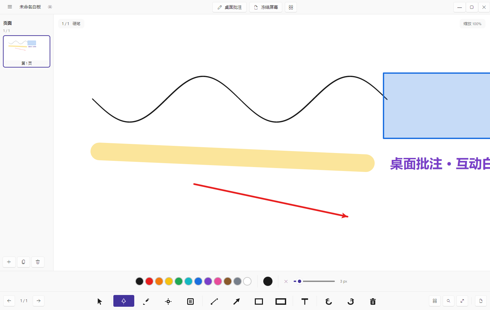
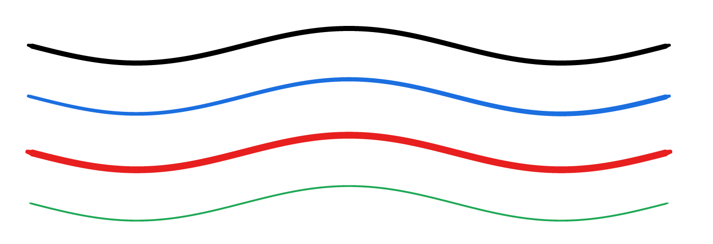
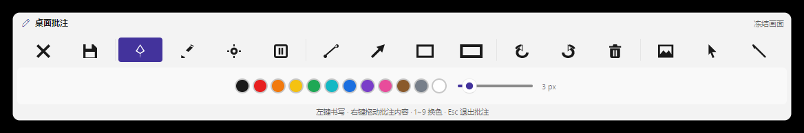
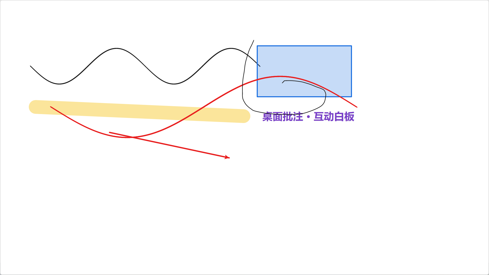

# 互动白板 WhiteBoard

基于 **.NET 8 + Avalonia 11 + FluentAvalonia** 的桌面白板 / 桌面批注程序。
界面参照希沃白板：底部 Fluent 工具条、左侧页面缩略图、顶部菜单栏，
以及最核心的「桌面批注」—— 一块**可拖动的独立工具条 + 全屏透明批注层**。



---

## 1. 快速开始

### 环境要求

| 项目 | 版本 |
| --- | --- |
| 目标框架 | `net8.0-windows` |
| .NET SDK | 8.0.4xx（仓库内 `global.json` 锁定 `8.0.416`） |
| Visual Studio | VS 2022 17.8+ / VS 2026（打开 `WhiteBoard.sln`） |
| UI 框架 | Avalonia 11.3.12 + FluentAvalonia 2.4.1 |
| MVVM | CommunityToolkit.Mvvm 8.2.1 |
| 操作系统 | Windows 10 1809+ / Windows 11（桌面批注依赖 Win32 API） |

### 一键构建 + 测试

```powershell
pwsh ./build.ps1                       # Release 构建 + 跑全部测试
pwsh ./build.ps1 -Configuration Debug
pwsh ./build.ps1 -SkipTests            # 只编译
pwsh ./build.ps1 -CaptureDir captures  # 额外输出界面截图
```

或手动逐个项目构建：

```powershell
dotnet build WhiteBoardApp\WhiteBoard.csproj -c Release
dotnet run   --project WhiteBoardApp\WhiteBoard.csproj -c Release
```

> **为什么不直接 build .sln？**
> 部分机器上 `dotnet build WhiteBoard.sln` 会因 .NET 工作负载清单不完整
> 报 `MSB4276` 而失败——这是环境问题，与工程代码无关。逐项目构建不受影响，
> `build.ps1` 就是按这个方式做的。Visual Studio 里正常打开 sln 编译。

### 目录约定

| 文件 | 作用 |
| --- | --- |
| `global.json` | 锁定 .NET SDK `8.0.416` |
| `nuget.config` | 离线还原：把本机 NuGet 缓存登记为包源 |
| `build.ps1` | 一键构建 + 测试 |
| `ui/` | 界面参考图（希沃截图、工具栏样式、笔触参考） |
| `docs/` | 本程序自己的界面截图 |

---

## 2. 功能一览

### 2.1 书写与绘制

| 工具 | 快捷键 | 说明 |
| --- | --- | --- |
| 硬笔 | `P` | 带**笔压**的变宽笔迹，落笔 / 抬笔自动收锋成笔尖 |
| 荧光笔 | `H` | 半透明粗笔触，叠加处自然变深 |
| 激光笔 | `L` | 临时轨迹，约 1.7 秒自动淡出，不写入文档 |
| 橡皮擦 | `E` | 像素橡皮（只擦掉笔尖经过的一段）或整笔擦除 |
| 直线 / 箭头 / 矩形 / 椭圆 | 一级入口 | 按住 `Shift` 约束正方形 / 45° 直线 |
| 文本 | `T` | 点击画布插入文字标注 |
| 选择 | `V` | 点选 / 框选 / 拖动对象，`Delete` 删除 |

笔迹处理分四步，手感接近真实书写：

1. **输入采样**：按指针压力记录 `(x, y, pressure, time)`
2. **曲线平滑**：Catmull-Rom 样条细分
3. **落笔 / 抬笔收锋**：两端沿切线延伸并降低压力，轮廓自然收成笔尖
4. **变宽轮廓 + 缓存**：沿法线按压力偏移生成闭合多边形；几何只算一次并缓存



### 2.2 桌面批注（核心功能）

批注由**两个窗口**组成，这是为了解决「鼠标穿透后工具条也点不动」的问题：

| 窗口 | 作用 |
| --- | --- |
| `AnnotationCanvasWindow` | 覆盖整个虚拟屏幕的**完全透明**窗口，只负责书写 |
| `AnnotationToolBarWindow` | **可拖动**的独立工具条（按住顶部手柄移动），永远置顶 |

因为鼠标穿透（`WS_EX_TRANSPARENT`）是按窗口生效的，把它只加在画布窗口上后，
**开启穿透时依然能点击工具条**退出批注或切回白板，不会被锁在批注层里。

两种工作模式：

- **透明覆盖**（`Ctrl+Alt+A`）：窗口全透明，直接对着真实桌面 / PPT / 网页书写
- **冻结画面**（`Ctrl+Alt+D`）：先把屏幕抓成位图当作**临时底图**再批注

> ⚠️ 冻结底图只属于本次批注会话（`WhiteboardCanvas.OverlayBackground`），
> **不会写进页面数据**，因此不会覆盖页面原有的批注内容。





### 2.3 多页白板

- 左侧页面缩略图导航（可折叠），实时渲染每页内容
- 新增 / 复制 / 删除 / 上一页 / 下一页
- 每页可单独命名、设置底色与底纹
- 底纹：空白 / 方格 / 横线 / 点阵 / **五线谱** / **田字格**

### 2.4 编辑与文件

- 无限撤销 / 重做
- 保存 / 打开 `.wbd` 文档（JSON）
- 导出当前页 / 全部页面为 PNG（1920×1080 / 2560×1440 / 3840×2160）
- 屏幕取色器（滴管）：抓取整屏后点击取色

---

## 3. 快捷键总表

```
【白板工具】
  P 硬笔      H 荧光笔     L 激光笔     E 橡皮擦     V 选择      T 文本

【编辑】
  Ctrl+Z 撤销     Ctrl+Y 重做      Delete 删除选中
  Ctrl+S 保存     Ctrl+Shift+S 另存为
  Ctrl+O 打开     Ctrl+N 新建      Ctrl+0 适应窗口
  F11 全屏        +/- 缩放

【画布】
  左键拖动   书写 / 绘制
  右键拖动   平移画布
  Ctrl+滚轮  以光标为中心缩放
  Shift      约束正方形 / 45° 直线

【桌面批注】
  Ctrl+Alt+A  切换桌面批注（全局热键，任何程序里都能用）
  Ctrl+Alt+D  冻结当前屏幕并批注（全局热键）
  Ctrl+Alt+W  显示 / 隐藏白板（全局热键）
  Ctrl+Alt+L  清空当前页（全局热键）
  1 ~ 9       批注层快速换色
  工具条顶部可拖动；Esc 退出批注
```

---

## 4. 主题与界面

- 使用 **FluentAvalonia** 作为控件库，`RequestedThemeVariant="Default"`
  → **自动跟随系统深色 / 浅色**，强调色为 Fluent 默认蓝
- 工具条用 FluentAvalonia 的 **`CommandBar`**，按钮类型与 WinUI 对应：

| WinUI | 本项目（FluentAvalonia） |
| --- | --- |
| `AppBarButton` | `CommandBarButton` |
| `AppBarToggleButton` | `CommandBarToggleButton` |

- 图标：自绘矢量路径（`PathIconSource`）+ Fluent `SymbolIconSource` 混用；
  橡皮按 `ui/clean.png` 画成圆角方框加两条竖条，按钮尺寸与其它工具一致
- 主界面与批注工具条**共用同一份按钮定义**（`ToolBarItems`），风格天然一致

> 实现细节：FluentAvalonia 的主题资源地址是跨程序集的
> （`avares://FluentAvalonia/...`），Avalonia 的 XAML 编译器无法在编译期解析，
> 因此主题在 `App.axaml.cs` 里用代码加载；
> 另外它的样式选择器精确匹配 `CommandBar` 类型，**不能继承 CommandBar 做子类**
> （会拿不到 ControlTemplate），所以按钮由 `FluentToolBarBuilder` 静态填充原生 `CommandBar`。

---

## 5. 项目结构

```
WhiteBoard.sln
├─ WhiteBoardApp/                    主程序（net8.0-windows）
│  ├─ Program.cs                     入口 + --smoke-test 自检 + --capture 截图
│  ├─ App.axaml(.cs)                 应用装配、FluentAvalonia 主题、全局热键
│  ├─ app.manifest                   Per-Monitor V2 DPI 感知
│  ├─ Assets/Icons.axaml             矢量图标资源
│  ├─ Models/                        文档模型（页 / 对象 / 笔迹 / 图形 / 文本）
│  ├─ Controls/
│  │   ├─ WhiteboardCanvas.cs        交互 + 渲染核心
│  │   └─ FluentToolBarBuilder.cs    把工具填充进 FluentAvalonia CommandBar
│  ├─ Services/
│  │   ├─ WhiteboardRenderer.cs      统一渲染（屏幕 / 缩略图 / 导出三处一致）
│  │   ├─ RenderCache.cs             单帧画刷 / 画笔缓存（消除每帧 GC 抖动）
│  │   ├─ StrokeGeometryBuilder.cs   样条平滑 + 收锋 + 变宽轮廓 + 抽稀
│  │   ├─ BitmapReleaser.cs          位图延迟释放（避免换图时原生崩溃）
│  │   ├─ UndoRedoService.cs         撤销栈与各类操作
│  │   ├─ WhiteboardFileService.cs   .wbd 读写 + PNG 导出
│  │   ├─ ThumbnailService.cs        页面缩略图（带缓存与节流）
│  │   ├─ ScreenCaptureService.cs    GDI 抓屏（虚拟屏幕 / 多显示器 / 高 DPI）
│  │   ├─ WindowCaptureService.cs    按窗口抓图（自动化验证用）
│  │   ├─ WindowInteropService.cs    鼠标穿透 / 置顶 / 工具窗口样式
│  │   ├─ GlobalHotKeyService.cs     系统级热键
│  │   ├─ AppSettings.cs             用户偏好持久化
│  │   └─ AppServices.cs             主窗口与批注层共享的状态容器
│  ├─ ViewModels/
│  │   ├─ EditorState.cs             共享画笔状态（工具 / 颜色 / 粗细…）
│  │   ├─ WhiteboardSession.cs       一次会话：文档 + 历史 + 缩略图 + 设置
│  │   ├─ ToolBarViewModel.cs        工具条定义与图标
│  │   ├─ MainWindowViewModel.cs     主窗口视图模型
│  │   └─ AnnotationOverlayViewModel.cs  批注会话视图模型（两个窗口共用）
│  └─ Views/
│      ├─ MainWindow.axaml(.cs)            主窗口
│      ├─ AnnotationCanvasWindow.*         批注画布（透明覆盖层）
│      ├─ AnnotationToolBarWindow.*        批注工具条（可拖动）
│      ├─ ScreenColorPickerWindow.cs       屏幕取色器
│      ├─ Dialogs.cs                       消息 / 确认 / 文本输入对话框
│      └─ AppStyles.axaml                  补充样式（跟随 Fluent 主题）
├─ WhiteBoard.Tests/                 外部冒烟测试（100 项，无需测试框架）
├─ WhiteBoard.InputTests/            交互回归测试（20 项，真实指针输入模拟）
├─ docs/                             本程序界面截图
├─ ui/                               界面参考图
├─ build.ps1                         一键构建 + 测试
├─ global.json / nuget.config / WhiteBoard.sln
```

---

## 6. 测试与验证

三套测试互补，都可以在无人工干预下跑完：

### 6.1 应用内自检（60 项）

在**真实应用上下文**里加载全部 XAML、构造主窗口与批注窗口、跑完整存盘流程：

```powershell
dotnet run --project WhiteBoardApp -- --smoke-test   # 退出码 0 = 全部通过
```

### 6.2 交互回归测试（20 项）

用**真实指针事件**驱动画布，覆盖拖动、橡皮、底纹性能与压力测试：

```powershell
dotnet run --project WhiteBoard.InputTests
```

### 6.3 外部冒烟测试（100 项）

几何算法、命中测试、序列化、撤销重做、离屏渲染、缩略图、PNG 导出、截图链路：

```powershell
dotnet run --project WhiteBoard.Tests -- artifacts
```

### 6.4 界面截图

```powershell
dotnet run --project WhiteBoardApp -- --capture captures
```

### 实测结果

```
应用内自检   : 通过 60  / 失败 0
交互回归测试 : 通过 20  / 失败 0
外部冒烟测试 : 通过 100 / 失败 0
```

---

## 7. 已修复的问题（本版本）

| # | 现象 | 根因 | 修复 |
| --- | --- | --- | --- |
| 1 | 橡皮卡顿、不跟手 | 每帧为每个对象新建 `SolidColorBrush`/`Pen`，并反复重算笔迹几何，GC 抖动严重 | 新增 `RenderCache` 复用画刷画笔；笔迹几何缓存；视口裁剪 |
| 2 | 切换底纹 / 背景时崩溃 | 缩略图换图时立即 `Dispose` 旧位图，而渲染线程仍在引用（Skia 访问已释放内存，无托管异常） | 新增 `BitmapReleaser`，位图延迟若干帧释放 |
| 3 | 导出功能不可用 | 入口挂在失效的菜单上 | 重新实现当前页 / 全部页 PNG 导出，并入新菜单与工具条 |
| 4 | 菜单点击无反应 | 旧菜单命令绑定链失效 | 重做顶栏菜单，命令直连 ViewModel |
| 5 | 冻结屏幕后原批注被截图覆盖 | 截图被写进 `Page.BackgroundImage`，整页背景被替换 | 冻结底图改为批注会话的**临时覆盖层**，不写入文档 |
| 6 | 批注层写不了字；开穿透后按钮点不动 | 单窗口架构下整个窗口一起穿透 | 拆成「可拖动工具条窗口 + 透明画布窗口」，穿透只作用于画布 |
| 7 | 拖动批注内容飞出屏幕 | ① 事件同时注册 Tunnel+Bubble 导致处理两次；② 拖动基准点未推进，每帧重复叠加总位移 | 只注册冒泡阶段；拖动后推进基准点 |

第 7 条有专门的回归测试（`WhiteBoard.InputTests`）：
分别在 100% / 已平移 / 200% 缩放下验证「拖动 N 像素，笔迹正好移动 N 像素」。

## 8. 已知限制

- **仅 Windows 可完整运行**：桌面批注依赖 `user32.dll` / `gdi32.dll`
- 桌面批注层**只读取**屏幕像素，不向其它程序注入输入
- 抓屏对部分全屏独占程序（某些全屏游戏、受保护视频）可能得到黑屏，属系统限制
- 像素橡皮按采样点切分笔画，极高密度交叉笔迹的边缘可能留下细小残段
- 未实现：图片插入、套索自由选区、压感曲线自定义、多用户协同

## 9. 许可

示例工程，可自由用于学习与二次开发。
